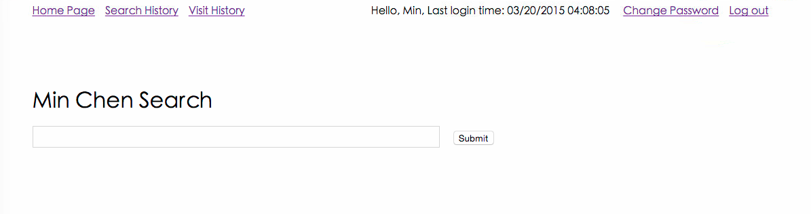
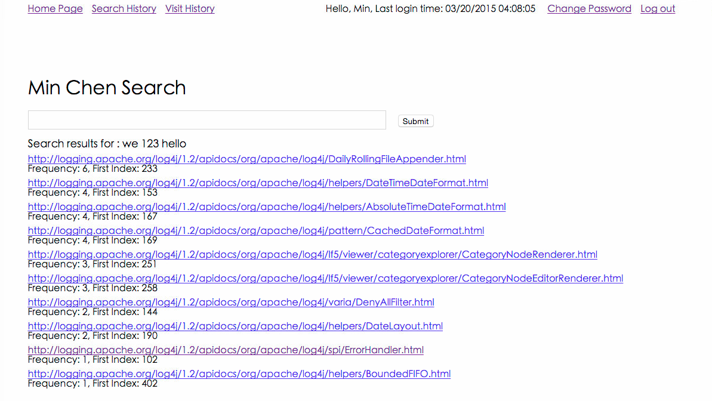

# Simple Search Engine
Follows this instruction: https://github.com/cs212/projects

It has Cour Fetures, Search History, Visited Results, Time Stamps, Last Login Time, User Account and User Data.

#Sample Pages
##Home Page

##Search Result Page

##Search History Page

##Visit History Page

